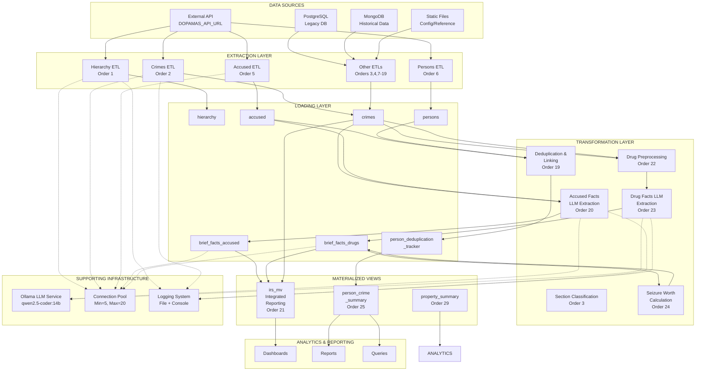
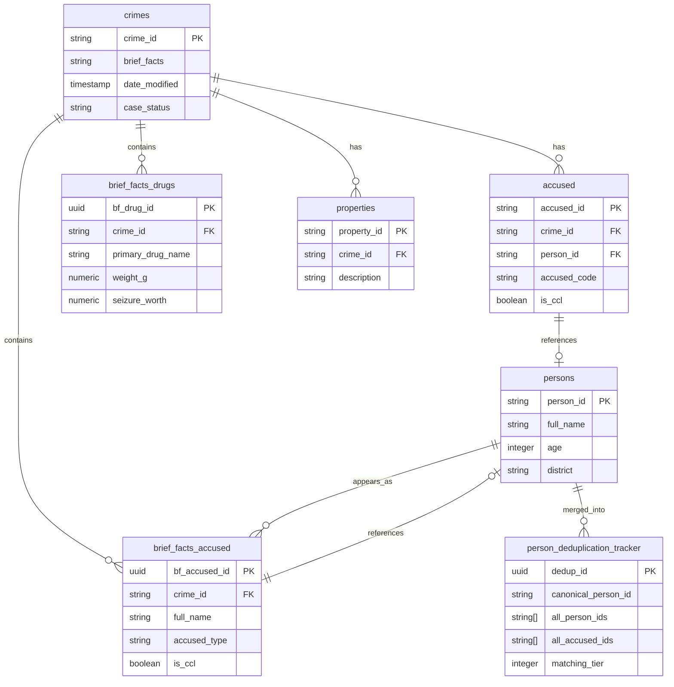

# DOPAMS ETL System - Solution Design Document

**Document Version:** 1.0  
**Date:** March 6, 2026  
**Project:** Digital Online Platform for Administration of Criminal Justice System (DOPAMS)  
**System:** DOPAMS ETL (Extract, Transform, Load) Pipeline  
**Repository:** dopams-etl-pipelines  

---

## Table of Contents

1. [Overview](#1-overview)
2. [Data Sources](#2-data-sources)
3. [ETL Pipeline Architecture](#3-etl-pipeline-architecture)
4. [Pipeline Flow](#4-pipeline-flow)
5. [Data Transformation Logic](#5-data-transformation-logic)
6. [Data Validation Rules](#6-data-validation-rules)
7. [Database Schema](#7-database-schema)
8. [Error Handling and Logging](#8-error-handling-and-logging)
9. [Performance Considerations](#9-performance-considerations)
10. [Pipeline Dependencies](#10-pipeline-dependencies)
11. [Deployment and Execution](#11-deployment-and-execution)
12. [Architecture Diagram](#12-architecture-diagram)

---

## 1. Overview

### 1.1 Purpose

The DOPAMS ETL Pipeline is a comprehensive criminal justice data integration system designed to extract, transform, and load data from multiple heterogeneous sources into a centralized PostgreSQL data warehouse. The system processes criminal case records, accused persons, crime properties, and drug-related evidence while applying intelligent data enrichment through LLM (Large Language Model) extraction.

### 1.2 Problem Statement

Criminal justice systems typically operate with fragmented, unstructured data scattered across multiple agencies and systems:

- **Disparate Sources**: Data exists in APIs, unstructured FIR (First Information Report) documents, MongoDb records, and external databases
- **Unstructured Content**: Crime brief facts are stored as free-form text without structured fields for accused types, drug information, or property details
- **Data Quality Issues**: Duplicate persons, inconsistent naming conventions, null/missing values, and data inconsistencies
- **Manual Extraction**: Critical information (accused types, drug classifications, seizure details) must be extracted from unstructured text
- **Scalability Challenges**: Sequential processing creates 2+ minute delays per batch, limiting throughput

### 1.3 Solution Approach

The DOPAMS ETL Pipeline addresses these challenges through:

1. **Multi-Source Ingestion**: Unified extraction from RESTful APIs, PostgreSQL databases, MongoDB, and static files
2. **Intelligent Transformation**: LLM-powered extraction of structured data from unstructured text
3. **Data Enrichment**: Classification, standardization, and deduplication of persons and properties
4. **Bulk Operations**: Connection pooling and batch inserts to minimize database overhead
5. **Comprehensive Validation**: Multi-layered validation rules with audit trails
6. **Materialized Views**: Pre-computed analytical views for reporting and dashboards

### 1.4 Key Capabilities

| Capability | Details |
|-----------|---------|
| **Processing Volume** | 100,000+ crime records, 500,000+ related records |
| **LLM Integration** | Local Ollama with 16KB context windows for text extraction |
| **Data Quality** | Deduplication, normalization, foreign key validation |
| **Performance** | Connection pooling, batch inserts, indexed queries |
| **Monitoring** | Comprehensive logging, query profiling, performance metrics |
| **Fault Recovery** | Checkpoint-based restart from last known position |

---

## 2. Data Sources

### 2.1 Primary Data Sources

#### 2.1.1 External API (DOPAMAS_API_URL)

| Property | Value |
|----------|-------|
| **Type** | RESTful HTTP API |
| **Protocol** | HTTP/HTTPS |
| **Authentication** | API_KEY (environment variable) |
| **Rate Limiting** | Chunk-based processing with exponential backoff retry |
| **Endpoints** | Multiple (detailed below) |

**Endpoints and Methods:**

| Order | Endpoint | Method | Data Model | Chunking Strategy |
|-------|----------|--------|-----------|------------------|
| 1 | `/master-data/hierarchy` | GET | Hierarchy classification data | 5-day ranges with 1-day overlap |
| 2 | `/crimes` | GET | Crime/FIR records with brief facts | 5-day ranges with 1-day overlap |
| 5 | `/accused` | GET | Accused person records | 5-day ranges with 1-day overlap |
| 6 | `/persons` | GET | Person demographic data | 5-day ranges with 1-day overlap |
| 7 | `/update-state-country` | GET | Geographic reference data | UPSERT on conflict |

**Processing Configuration:**

- **Chunking**: 5-day date ranges with 1-day overlap for continuity assurance
- **Resumption**: Queries `max(date_modified)` to resume from last checkpoint
- **Error Handling**: Exponential backoff retry with 3-5 attempts per chunk
- **Timeout**: 120-second request timeout to prevent silent hangs

#### 2.1.2 PostgreSQL Database (Internal)

| Property | Value |
|----------|-------|
| **Type** | Relational Database |
| **Engine** | PostgreSQL 16.11 (Ubuntu 16.11-1.pgdg24.04+1) |
| **Purpose** | Primary data warehouse and intermediate staging |
| **Connection Strategy** | Pooled connections (min=5, max=20) |
| **Keepalive** | TCP keepalive every 30 seconds, 5-count threshold |

**Tables Populated:**
- `hierarchy` — Classification hierarchies
- `crimes` — FIR records with full brief facts
- `accused` — Accused persons linked to crimes
- `persons` — Person demographic data
- `brief_facts_accused` — LLM-extracted accused information
- `brief_facts_drugs` — LLM-extracted drug information
- `brief_facts_properties` — Property/evidence details
- `case_property` — FSL case evidence properties
- `persons_deduplication_tracker` — Deduplication results
- Materialized views for reporting

#### 2.1.3 MongoDB (Legacy/Parallel)

| Property | Value |
|----------|-------|
| **Type** | NoSQL Document Store |
| **Purpose** | Legacy data for directed migration to PostgreSQL |
| **Data Models** | Interrogation reports, person records, historical data |
| **Connector** | `pymongo` library with connection pooling |

**Collections:**
- `interrogation_reports` — Interview and interrogation records
- `persons` — Person records (legacy format)
- `properties` — Property/evidence records (document format)

#### 2.1.4 Static Configuration Files

| File | Type | Purpose | Format |
|------|------|---------|--------|
| `drug_mappings.json` | Knowledge Base | Drug standardization reference | JSON mapping raw → standard names |
| `input.txt` | Configuration | Crime IDs to process (manual mode) | Text file, line-delimited IDs |
| `drug-types.txt` | Reference | Known drug classifications | Text file, category list |
| `.env` | Configuration | Database credentials, LLM endpoints, ports | Key=value pairs |

### 2.2 Data Source Configuration

All data source connections are configured through environment variables:

```bash
# Database
DB_NAME=dopams_prod
DB_USER=dev_dopamas
DB_PASSWORD=***secured***
DB_HOST=192.168.103.106
DB_PORT=5432

# API
DOPAMAS_API_URL=http://api-server:8000
API_KEY=***secured***

# LLM
OLLAMA_HOST=http://localhost:11434
LLM_MODEL_EXTRACTION=qwen2.5-coder:14b
LLM_CONTEXT_WINDOW=16384

# MongoDB (Legacy)
MONGODB_URI=mongodb://mongo-server:27017/dopams_prod

# Processing
BATCH_SIZE=5
PARALLEL_LLM_WORKERS=3
```

### 2.3 Data Source Summary

| Source | Type | Frequency | Volume | Format |
|--------|------|-----------|--------|--------|
| External API | API | 5-day scanned chunks, daily runs | 10K-50K new records/day | JSON REST |
| PostgreSQL | Database | Continuous read/write | 100K crime, 500K related | SQL |
| MongoDB | NoSQL | On-demand migration | Legacy millions | BSON/JSON |
| Static Files | File | Configuration-driven | Reference data | JSON/Text |

---

## 3. ETL Pipeline Architecture

### 3.1 Architectural Components

The DOPAMS ETL Pipeline consists of five key layers:

```
┌─────────────────────────────────────────────────────────────┐
│                    EXTRACTION LAYER                         │
│  (API polling, database queries, file reads)                │
└─────────────────────────────────────────────────────────────┘
                           ↓
┌─────────────────────────────────────────────────────────────┐
│                   TRANSFORMATION LAYER                      │
│  (LLM extraction, standardization, deduplication)           │
└─────────────────────────────────────────────────────────────┘
                           ↓
┌─────────────────────────────────────────────────────────────┐
│                   VALIDATION LAYER                          │
│  (Format checks, referential integrity, deduplication)      │
└─────────────────────────────────────────────────────────────┘
                           ↓
┌─────────────────────────────────────────────────────────────┐
│                    LOADING LAYER                            │
│  (Batch inserts, UPSERT, transaction management)            │
└─────────────────────────────────────────────────────────────┘
                           ↓
┌─────────────────────────────────────────────────────────────┐
│                  MATERIALIZED VIEWS                         │
│  (Analytical views, reporting aggregations)                 │
└─────────────────────────────────────────────────────────────┘
```

### 3.2 Extraction Layer

#### 3.2.1 API Extraction

**Process:**
1. Query external API with 5-day date range windows
2. Implement exponential backoff retry on failures (3-5 attempts)
3. Parse JSON response into Python dictionaries
4. Handle pagination and chunking transparently

**Key Classes:**
- `etl_hierarchy.py` → Extracts hierarchy data from `/master-data/hierarchy`
- `etl_crimes.py` → Fetches crime/FIR records with brief facts
- `etl_accused.py` → Extracts accused information from `/accused` endpoint
- `etl_persons.py` → Retrieves person demographic data

#### 3.2.2 Database Extraction

**Process:**
1. Establish pooled connection to PostgreSQL
2. Execute SELECT queries with date-based filters
3. Fetch data in configurable batch sizes (default 5)
4. Return as RealDictCursor for field-name access

**Key Functions:**

```python
# From brief_facts_drugs/db.py
def fetch_unprocessed_crimes(conn, limit=100):
    """Fetch crimes without drug brief facts"""
    
def fetch_drug_categories(conn):
    """Fetch knowledge base for drug standardization"""

# From brief_facts_accused/db.py
def fetch_crimes_for_accused_extraction(conn, limit=100):
    """Fetch crimes ready for accused extraction"""
```

#### 3.2.3 File-Based Extraction

**Process:**
1. Read configuration from `input.txt` (manual mode)
2. Parse crime IDs from file (one per line)
3. Filter out comments (lines starting with `#`)
4. Use IDs to fetch specific records from database

### 3.3 Transformation Layer

#### 3.3.1 LLM-Powered Extraction

The transformation layer uses local Ollama LLM to extract structured data from unstructured FIR text.

**Two Primary Extraction Tasks:**

**A. Accused Facts Extraction**

- **Input**: Crime brief_facts (FIR narrative text)
- **Model**: `qwen2.5-coder:14b` (14B parameter model)
- **Output Model**: `AccusedExtraction`
- **Process**:
  1. **Pass 1**: Extract list of accused names from text
  2. **Pass 2**: Extract detailed information for each accused
  3. Normalize names, handle aliases, extract roles
  4. Classify accused type (peddler, supplier, consumer, etc.)
  5. Store in `brief_facts_accused` table

**Example Extraction:**

Input FIR: "…arrested Rajesh Kumar s/o Mohan Singh, known alias Rocky aged 35 years, who was involved in peddling NDPS substances…"

Output:
```json
{
  "full_name": "Rajesh Kumar",
  "alias_name": "Rocky",
  "age": 35,
  "gender": "Male",
  "accused_type": "peddler",
  "status": "arrested",
  "role_in_crime": "involved in peddling NDPS substances"
}
```

**B. Drug Facts Extraction**

- **Input**: Crime brief_facts (FIR narrative text)
- **Model**: `qwen2.5-coder:14b`
- **Output Model**: `DrugExtraction` with unit standardization
- **Process**:
  1. **Pre-process**: Filter multi-FIR concatenated text for drug relevance
  2. **Extract**: Parse drug name, quantity, units, form
  3. **Standardize**: Convert units to grams/kg/ml/liters
  4. **Classify**: Match drug against `drug_categories` knowledge base
  5. **Calculate**: Compute seizure worth based on market rates
  6. Store in `brief_facts_drugs` table

**Multi-FIR Pre-processor:**
- Detects multiple concatenated FIR cases in single brief_facts field
- Splits on "IN THE HONOURABLE COURT..." boundaries
- Scores each section for drug-relevance using keyword matching
- Returns only drug-relevant sections to LLM (saves 50%+ tokens)

**Drug Relevance Scoring:**
- Tier 1 Keywords: "NDPS", "ganja", "heroin", "cocaine", etc. (instant match)
- Tier 2 Keywords: "seized", "substance", "powder", "seizure" (contextual)
- NDPS Section Match: Regex match for IPC/NDPS section references

#### 3.3.2 Data Standardization

**Drug Standardization:**

```python
# From drug_standardization.py
def standardize_units(quantity, from_unit, drug_form='powder'):
    """
    Convert all units to standard forms:
    - Weight: grams (g), kilograms (kg)
    - Volume: milliliters (ml), liters (l)
    - Count: total items/tablets/capsules
    """
    
# Example:
standardize_units(250, 'milliliter', 'liquid')
# Returns: {"volume_ml": 250, "volume_l": 0.25}

SEIZURE_WORTH_CALCULATOR:
# Calculates market value based on drug type and quantity
# Formula: weight_standard_unit × market_rate_per_unit
# Result stored in crores (10 million INR)
```

**Person Deduplication:**

Using person fingerprinting and matching strategies:

1. **Exact Match**: Full name + age + parent name + other_fields
2. **Fuzzy Match**: Name similarity (Levenshtein) + age proximity
3. **Tier-based Confidence**: 5-tier matching confidence system
   - Tier 1: Perfect match (exact duplicate)
   - Tier 2: High confidence
   - Tier 3: Good confidence
   - Tier 4: Medium confidence
   - Tier 5: Low confidence (requires manual review)

**Domicile Classification:**

Based on location data, classifies persons as:
- Local (same district)
- State (same state, different district)
- Inter-state
- Unknown/Unclassified

#### 3.3.3 Error Handling During Transformation

```python
# From core/llm_service.py
def invoke_extraction_with_retry(prompt, max_retries=3):
    """
    Retry LLM extraction with exponential backoff
    - Attempt 1: immediate
    - Attempt 2: after 5 seconds
    - Attempt 3: after 15 seconds
    Raises LLMExtractionError if all attempts fail
    """

# Pydantic model validation
from pydantic import BaseModel, ValidationError
@dataclass
class AccusedExtraction(BaseModel):
    full_name: str  # Required
    alias_name: Optional[str]  # Optional
    # Validates on construction
```

### 3.4 Validation Layer

Comprehensive validation is applied at multiple points:

#### 3.4.1 Schema Validation
- Pydantic model validation (type checking, required fields)
- Constraint checking (enum values for accused_type, status)
- Format validation (phone numbers, addresses)

#### 3.4.2 Business Logic Validation
- Null/empty field checks (e.g., full_name required for accused)
- Referential integrity (FK constraints: crime_id must exist in crimes table)
- Uniqueness constraints (e.g., person_id unique within crime context)
- Numeric range validation (age 0-120, confidence_score 0-1)

#### 3.4.3 Data Quality Checks
- Duplicate detection (same person record appearing multiple times)
- Missing mandatory fields (e.g., crime_id, person_id)
- Outlier detection (e.g., unusually high seizure values)
- Format validation (regex patterns for phone, email, addresses)

### 3.5 Loading Layer

#### 3.5.1 Batch Insert Operations

```python
# From db_pooling.py
def batch_insert_drug_facts(conn, inserts):
    """
    Batch-insert multiple rows in single transaction.
    
    BEFORE (10-20x slower):
        for item in items:
            cur.execute(INSERT, (item_data))
            conn.commit()  # Commit per row!
    
    AFTER (10-20x faster):
        batch_insert_drug_facts(conn, items)
        # Single transaction, single commit
    
    Expected: 1000 records in 200ms (vs. 4000ms individually)
    """
    query = sql.SQL("""
        INSERT INTO {table} (crime_id, raw_drug_name, ...)
        VALUES %s
        ON CONFLICT (crime_id) DO UPDATE SET ...
    """).format(table=sql.Identifier(table_name))
    
    execute_batch(cur, query, prepare_values(inserts))
    conn.commit()  # Single commit for 1000s of rows
```

#### 3.5.2 Upsert Strategy

Uses PostgreSQL `ON CONFLICT` clause:

```sql
INSERT INTO brief_facts_accused (crime_id, accused_id, full_name, ...)
VALUES (%s, %s, %s, ...)
ON CONFLICT (crime_id, accused_id) DO UPDATE SET
    full_name = EXCLUDED.full_name,
    date_modified = CURRENT_TIMESTAMP,
    extraction_metadata = EXCLUDED.extraction_metadata;
```

**Conflict Resolution:**
- If record exists: UPDATE with new extracted data
- If record is new: INSERT
- Always set `date_modified` to current timestamp
- Preserve extraction_metadata in JSON audit field

#### 3.5.3 Connection Pooling

```python
# From db_pooling.py
class PostgreSQLConnectionPool:
    """
    Singleton thread-safe connection pool.
    
    BEFORE (100ms per connection):
        conn = psycopg2.connect(...)  # Creates new conn
        
    AFTER (1ms, reused):
        conn = PostgreSQLConnectionPool().get_connection()
        
    Expected improvement: 10-15% latency reduction
    """
    minconn = 5   # Keep 5 connections ready
    maxconn = 20  # Allow up to 20 concurrent
    keepalive = 30 seconds
```

### 3.6 Materialized Views

Final step creates denormalized views for reporting:

| View | Purpose | Refresh Order |
|------|---------|-------|
| `irs_mv` | Integrated crime records with all brief facts | Order 21 |
| `person_crime_summary` | Person → all linked crimes | Order 25 |
| `property_summary` | Property/seizure aggregations | Order 29 |

---

## 4. Pipeline Flow

### 4.1 Daily Processing Flow (Sequential Execution)

The master ETL script processes data in 29 sequential orders, with checkpoint-based restart capability:

```
START: Check last successful order
        ↓
[Order 1] Hierarchy ETL
        ↓
[Order 2] Crimes ETL (API → crimes table)
        ↓
[Order 3] Section Classification (Crime classification)
        ↓
[Order 4] Case Status Update (Journey state transitions)
        ↓
[Order 5] Accused ETL (API → accused table)
        ↓
[Order 6] Persons ETL (API → persons table)
        ↓
[Order 7] State/Country Update (Reference data)
        ↓
[Order 8] Domicile Classification (Geographic analysis)
        ↓
[Order 9] Person Name Fixing (Standardization)
        ↓
[Order 10] Full Name Fixes (Normalization)
        ↓
[Order 11] Properties ETL
        ↓
[Order 12] Interrogation Reports ETL
        ↓
[Order 13] Disposal ETL
        ↓
[Order 14] Arrests ETL
        ↓
[Order 15] MO Seizures ETL
        ↓
[Order 16] Chargesheet ETL
        ↓
[Order 17] FSL Case Property ETL
        ↓
[Order 18] Updated Chargesheet ETL
        ↓
[Order 19] Person Deduplication & Linking
        ↓
[Order 20] Accused Brief Facts (LLM extraction)
        ↓
[Order 21] Refresh IRS Materialized View
        ↓
[Order 22] Drug Standardization (Preprocessing)
        ↓
[Order 23] Drug Facts Extraction (LLM extraction)
        ↓
[Order 24] Seizure Worth Calculation
        ↓
[Order 25] Refresh Person Crime Summary View
        ↓
[Order 26] MongoDB to PostgreSQL Migration
        ↓
[Order 27] Mongo to Postgres ETL (Final)
        ↓
[Order 28] Import Data (CSV/bulk load)
        ↓
[Order 29] Refresh Page Property Summary View
        ↓
[Order 30] (Optional) Full Database Validation
        ↓
COMPLETE: Log success, reset for next run
```

### 4.2 Detailed Step-by-Step Execution (Orders 1-10)

#### Order 1: Hierarchy ETL

```
Input:  DOPAMAS_API_URL/master-data/hierarchy
Process:
  1. Query date range: last_modified_checkpoint to now
  2. Fetch hierarchy records (chunked 5-day windows)
  3. Detect schema evolution (new/missing fields)
  4. Validate against PostgreSQL schema
  5. INSERT or UPDATE hierarchy table
  6. Log chunk-wise metrics (count, errors)
Output: hierarchy table populated
```

#### Order 2-10: Core Entity ETLs

**Pattern (repeated for Crimes, Accused, Persons):**

```
1. FETCH Phase (API/DB Query)
   └─ Query: SELECT * FROM source WHERE date_modified > checkpoint
   └─ Chunking: 5-day windows with 1-day overlap
   └─ Retry: Exponential backoff on API failures

2. TRANSFORM Phase (Data Cleaning)
   └─ Null handling: Replace NULL with defaults or skip record
   └─ Type casting: Convert string dates to timestamps
   └─ Normalization: Uppercase/lowercase standardization
   └─ Name cleaning: Remove prefixes, metadata, standardize format

3. VALIDATE Phase (Schema + Business Rules)
   └─ Schema: Pydantic validation
   └─ FK checks: Ensure referenced records exist
   └─ Uniqueness: No duplicate crime_ids in single batch
   └─ Mandatory fields: crime_id, ps_code required

4. LOAD Phase (Write to Database)
   └─ Prepare batch: 100-1000 records
   └─ Execute UPSERT: INSERT ... ON CONFLICT
   └─ Commit: Single transaction
   └─ Log: Count, duration, errors

5. CHECKPOINT Phase (Resume Capability)
   └─ Store: max(date_modified) = 2026-03-05 15:30:00
   └─ Method: Store in database or file
   └─ Next run: Resume from checkpoint, not from start
```

### 4.3 LLM-Based Extraction Flow (Orders 20, 23)

#### Order 20: Accused Brief Facts Extraction

```
1. FETCH unprocessed crimes
   └─ Query: crimes without brief_facts_accused records
   └─ Limit: BATCH_SIZE (default 5)
   
2. PARALLEL PROCESSING (ThreadPoolExecutor)
   For each crime (3 concurrent by default):
   
   3a. EXTRACTION - Pass 1 (Name Extraction)
       Input:  crime.brief_facts (FIR text)
       Prompt: "Extract all accused names from this FIR"
       LLM:    qwen2.5-coder:14b
       Output: List[accused_name]
   
   3b. EXTRACTION - Pass 2 (Details Extraction)
       For each accused_name:
       Input:  crime.brief_facts + accused_name
       Prompt: "Extract details for {accused_name}: age, gender, occupation..."
       LLM:    qwen2.5-coder:14b
       Output: AccusedExtraction model
   
   3c. VALIDATION
       ├─ Pydantic validation (required fields)
       ├─ Name cleaning (remove prefixes, aliases, metadata)
       ├─ Age range check (0-120)
       ├─ Accused type classification
       └─ CCL (Child Conflict Law) detection
   
   3d. LOAD (Batch Insert)
       └─ Collect all extracted accused
       └─ batch_insert_accused_facts(conn, extractions)
       └─ Upsert on (crime_id, accused_id)

4. ERROR HANDLING
   └─ Failed extraction: Log, skip, continue with next crime
   └─ Validation failure: Fallback to defaults, audit trail
   └─ LLM timeout (>120s): Retry up to 3 times, then mark failed
   
5. CHECKPOINT
   └─ Mark: crime_id as processed in brief_facts_accused
   └─ Next batch: Fetch unprocessed again
```

#### Order 23: Drug Facts Extraction

```
1. FETCH unprocessed crimes
   └─ Query: crimes without brief_facts_drugs records
   
2. PREPROCESSING (Deterministic Python, no LLM)
   For each crime.brief_facts:
   └─ Split on multi-FIR boundaries
   └─ Score each section for drug-relevance
   └─ Keep only sections scoring >= 50 (drug-relevant)
   └─ Result: Filtered text (saves ~50% of tokens)
   
3. PARALLEL LLM EXTRACTION (ThreadPoolExecutor, 3 workers)
   For each crime:
   
   3a. EXTRACTION
       Input:  filtered_brief_facts
       Prompt: "Extract drug information: name, quantity, units, form, description..."
       LLM:    qwen2.5-coder:14b (16KB context window)
       Output: DrugExtraction model (JSON structured)
   
   3b. STANDARDIZATION
       Input:  raw_quantity="500", raw_unit="milliliter"
       └─ Look up: drug_form from knowledge base
       └─ Call: standardize_units(500, 'milliliter', form)
       Output: {"volume_ml": 500, "volume_l": 0.5}
   
   3c. VALIDATION
       ├─ Drug name: Match against drug_categories or mark 'unknown'
       ├─ Quantity: Assert positive numbers
       ├─ Units: Validate enum (g, kg, ml, l, count)
       ├─ Confidence: 0.0-1.0 float
       └─ Seizure worth: Non-negative float
   
   3d. SEIZURE WORTH CALCULATION
       Formula: weight_standard × market_rate_per_unit ÷ 10_000_000
       Example: 1kg Heroin × ₹50,000/kg = ₹50,00,000 = 0.50 crores
   
   3e. LOAD (Batch Insert)
       └─ batch_insert_drug_facts(conn, extractions)
       └─ Upsert on (crime_id, raw_drug_name)

4. ERROR HANDLING
   └─ Empty/no drugs found: Insert NO_DRUGS_EXTRACTED marker
   └─ Extraction failure: Log, mark crime as failed_extraction
   └─ Duplicate drugs: Aggregate with merge_duplicates()
   
5. CHECKPOINT
   └─ Mark: crime_id processed
   └─ Metrics: Count extracted, unknown drugs, errors
```

### 4.4 Data Quality Controls (Continuous)

```
For every inserted record:
1. NOT NULL checks (required fields)
2. FK constraint checks (referenced records must exist)
3. Enum validation (accused_type in enum list)
4. Range checks (age bounds, confidence *)
5. Format validation (regex for phone, email)
6. Duplication detection
7. Audit trail: date_created, date_modified, user, operation
8. Logging: All operations logged to file and stdout
```

---

## 5. Data Transformation Logic

### 5.1 Cleaning Rules

#### 5.1.1 Null/Empty Handling

| Field | Rule | Action |
|-------|------|--------|
| `crime_id` | Required | Reject if NULL or empty |
| `brief_facts` | Required for LLM extraction | Skip if empty, extract 0 drugs/accused |
| `full_name` (accused) | Required | Use "Unknown" if NULL, log warning |
| `age` | Optional | Use NULL or -1 if missing |
| `phone_numbers` | Optional | Use NULL or empty string if missing |

#### 5.1.2 Text Normalization

```python
def normalize_text(text):
    """
    1. Strip leading/trailing whitespace
    2. Convert multiple spaces to single space
    3. Normalize line endings to \n
    4. Remove control characters
    5. Decode unicode/escape sequences
    """
    text = text.strip()  # Remove leading/trailing spaces
    text = ' '.join(text.split())  # Multiple spaces → single
    text = '\n'.join(text.splitlines())  # Normalize line endings
    return text

def normalize_name(name):
    """
    Clean person/accused names of metadata and prefixes.
    Input:  "A-1) John Doe@Rocky s/o Smith r/o Block-5, Age:35, Cell:9999999999"
    Output: "John Doe"
    
    Process:
    1. Remove prefix: A-1), 1), etc.
    2. Split on alias: @ symbol
    3. Split on relational: s/o, d/o, w/o, h/o
    4. Split on address: r/o, h.no
    5. Split on attributes: age:, cell:, etc.
    6. Remove trailing parentheses: (absconding), (deceased)
    """
    # Regex-based prefix removal
    name = re.sub(r'^(A-?\d+|[0-9]+)[\)\.\:\s]+', '', name)
    
    # Split on known separators (case-insensitive)
    separators = [' @ ', ' s/o ', ' d/o ', ' r/o ', ' age:', ' cell:']
    for sep in separators:
        if sep.lower() in name.lower():
            name = name.split(sep)[0]
    
    # Remove trailing parentheses
    name = re.sub(r'\s*\(.*?\)$', '', name)
    
    return name.strip()
```

#### 5.1.3 Date/Timestamp Standardization

```python
from dateutil import parser
from datetime import datetime

def parse_date(date_str, default=None):
    """
    Flexible date parsing supporting multiple formats.
    Formats: "2026-03-05", "03-05-2026", "2026/03/05", etc.
    """
    if not date_str or date_str is None:
        return default
    
    try:
        return parser.parse(date_str)
    except:
        logger.warning(f"Could not parse date: {date_str}")
        return default
```

### 5.2 Mapping Logic

#### 5.2.1 Accused Type Classification

Maps natural language descriptions to standardized accused types:

| Input Text | Classification | Confidence |
|-----------|---|---|
| "involved in peddling NDPS" | `peddler` | High |
| "supplier of contraband substances" | `supplier` | High |
| "consumer of narcotic drugs" | `consumer` | High |
| "kingpin operating drug network" | `organizer_kingpin` | High |
| "harbouring accused persons" | `harbourer` | High |
| "processing and manufacturing drugs" | `processor` | Medium |
| "transporting substances" | `transporter` | High |
| "financing illegal operations" | `financier` | Medium |
| "manufacturing controlled substances" | `manufacturer` | High |
| "producing poppy/cannabis" | `producer` | High |

**LLM Extraction Prompt:**

```
Based on the accused's role in the crime described above, 
classify their accused type.

Classification options:
- peddler: Sells or distributes drugs
- consumer: Uses drugs
- supplier: Provides drugs to others
- harbourer: Gives shelter to criminals
- organizer_kingpin: Leads criminal organization
- processor: Processes raw drugs
- financier: Funds criminal activity
- manufacturer: Makes drugs
- transporter: Moves drugs
- producer: Grows/cultivates drugs
- unknown: Cannot classify

Respond with single category name.
```

#### 5.2.2 Drug Standardization Mapping

```python
# From drug_standardization/drug_mappings.json
{
  "ganja": {
    "standard_name": "Marijuana/Cannabis",
    "category": "plant_based",
    "iupac": "Cannabis sativa L.",
    "schedule": "Schedule I (NDPS)",
    "form_common": "dried_flowers",
    "conversion": {
      "gram_to_kg": 0.001,
      "count_to_gram": null  # Context-dependent
    }
  },
  "brown sugar": {
    "standard_name": "Heroin/Diacetylmorphine",
    "category": "opioid",
    "schedule": "Schedule I (NDPS)",
    "form_common": "powder_brown",
    "conversion": {
      "gram_to_kg": 0.001
    }
  },
  // ... 500+ more mappings
}

def standardize_drug_name(raw_name):
    """
    Map raw drug name to standard category.
    Returns: (standard_name, category, confidence)
    """
    lower = raw_name.lower().strip()
    
    # Exact match
    if lower in drug_mappings:
        return drug_mappings[lower]['standard_name']
    
    # Fuzzy match (Levenshtein distance)
    best_match = fuzzy_match(lower, drug_mappings.keys())
    if best_match and similarity > 0.8:
        return drug_mappings[best_match]['standard_name']
    
    # Not found
    return 'unknown'
```

#### 5.2.3 Drug Form Standardization

```python
def standardize_drug_form(raw_form, drug_name=None):
    """
    Standardize drug form to canonical representation.
    """
    form_map = {
        'powder': 'powder',
        'tablet': 'tablet',
        'capsule': 'capsule',
        'liquid': 'liquid',
        'paste': 'paste',
        'plant': 'plant_material',
        'flower': 'plant_material',
        'leaf': 'plant_material',
        'dried': 'dried_flowers',
        'wet': 'wet_plant',
    }
    
    lower = (raw_form or '').lower()
    return form_map.get(lower, 'unknown')
```

### 5.3 Normalization Steps

#### 5.3.1 Unit Standardization

All quantity measurements normalized to standard units:

```python
def standardize_units(quantity, from_unit, drug_form='powder'):
    """
    Convert arbitrary units to standard forms.
    
    Input: 500, 'mg'
    Output: {'weight_g': 0.5, 'weight_kg': 0.0005, ...}
    """
    if quantity is None or quantity == 0:
        return {
            'weight_g': None, 'weight_kg': None,
            'volume_ml': None, 'volume_l': None,
            'count_total': None
        }
    
    quantity = float(quantity)
    from_unit = from_unit.lower().strip()
    
    # Weight conversions
    if from_unit in ['mg', 'milligram']:
        return {'weight_g': quantity / 1000, 'weight_kg': quantity / 1_000_000}
    elif from_unit in ['g', 'gram']:
        return {'weight_g': quantity, 'weight_kg': quantity / 1000}
    elif from_unit in ['kg', 'kilogram']:
        return {'weight_g': quantity * 1000, 'weight_kg': quantity}
    
    # Volume conversions
    elif from_unit in ['ml', 'milliliter']:
        return {'volume_ml': quantity, 'volume_l': quantity / 1000}
    elif from_unit in ['l', 'liter']:
        return {'volume_ml': quantity * 1000, 'volume_l': quantity}
    
    # Count
    elif from_unit in ['count', 'piece', 'tablet', 'pill', 'capsule']:
        return {'count_total': int(quantity)}
    
    else:
        logger.warning(f"Unknown unit: {from_unit}")
        return {'weight_g': None, 'volume_ml': None, 'count_total': None}
```

#### 5.3.2 Phone Number Normalization

```python
def normalize_phone(raw_phone):
    """
    Normalize Indian phone numbers to consistent format.
    
    Input: "+91-9876543210", "9876543210", "91 9876 543 210"
    Output: "9876543210"
    """
    if not raw_phone:
        return None
    
    # Remove all non-digits
    phone = re.sub(r'\D', '', str(raw_phone))
    
    # Remove leading 91 if present (country code)
    if phone.startswith('91') and len(phone) == 12:
        phone = phone[2:]
    
    # Validate length
    if len(phone) not in [10, 11]:
        logger.warning(f"Invalid phone length: {raw_phone} → {phone}")
        return None
    
    return phone
```

#### 5.3.3 Address Normalization

```python
def normalize_address(raw_address):
    """
    Clean and standardize addresses.
    """
    if not raw_address:
        return None
    
    address = raw_address.strip()
    
    # Remove extra whitespace
    address = ' '.join(address.split())
    
    # Standardize common abbreviations
    replacements = {
        'h.no': 'H.No.',
        'h no': 'H.No.',
        'street': 'St.',
        'road': 'Rd.',
        'square': 'Sq.',
    }
    
    for old, new in replacements.items():
        address = re.sub(r'\b' + old + r'\b', new, address, flags=re.IGNORECASE)
    
    return address
```

### 5.4 Data Enrichment

#### 5.4.1 Confidence Score Extraction

LLM extracts confidence for each field:

```python
class DrugExtraction(BaseModel):
    confidence_score: float = Field(
        description="Overall confidence (0.0-1.0) that the extraction is correct"
    )
    # If LLM extracts on scale 0-100, convert to 0.0-1.0:
    # confidence = min(int(raw_confidence), 100) / 100.0
```

#### 5.4.2 Seizure Worth Calculation

```python
def calculate_seizure_worth(drug_name, weight_grams=None, weight_kg=None):
    """
    Calculate market value of seized drugs in crores (10M INR).
    
    Market rates (as of 2026):
    - Heroin: ₹50,000/g = ₹50,00,00,000/kg
    - Cocaine: ₹40,000/g
    - MDMA: ₹3,000/g
    - Ganja: ₹200/g
    - LSD: ₹1,000/mg (liquid)
    """
    market_rates = {
        'heroin': 50000,
        'cocaine': 40000,
        'mdma': 3000,
        'ganja': 200,
        'lsd': 1000,  # per mg
        'mephedrone': 5000,
        # ... more drugs
    }
    
    rate = market_rates.get(drug_name.lower(), 0)
    if rate == 0:
        return 0.0
    
    # Determine weight in grams
    weight_g = weight_grams or (weight_kg * 1000 if weight_kg else 0)
    
    # Calculate value
    value_rupees = weight_g * rate
    value_crores = value_rupees / 10_000_000
    
    return round(value_crores, 2)
```

#### 5.4.3 Deduplication & Entity Linking

Person deduplication using fingerprinting:

```python
def create_person_fingerprint(person_record):
    """
    Create deterministic fingerprint for deduplication.
    Fingerprint = hash(normalized_fields)
    """
    fingerprint_fields = [
        normalize_name(person_record['full_name']),
        str(person_record.get('age') or 'unknown'),
        normalize_name(person_record.get('parent_name') or ''),
        str(person_record.get('phone') or ''),
        str(person_record.get('district') or ''),
    ]
    
    fingerprint = '|'.join(fingerprint_fields)
    return hashlib.sha256(fingerprint.encode()).hexdigest()[:16]

def find_duplicate_persons(person1, person2):
    """
    Fuzzy matching to find duplicate person records.
    Returns: (is_duplicate, confidence_tier)
    
    Tiers:
    1. Perfect match (identical fingerprint)
    2. High confidence (name + age + parent)
    3. Good confidence (name + district)
    4. Medium confidence (name + age)
    5. Low confidence (name only)
    """
    # Tier 1: Exact match
    if create_person_fingerprint(person1) == create_person_fingerprint(person2):
        return (True, 1)
    
    # Tier 2: Name + age + parent match
    if (fuzz_match(person1['full_name'], person2['full_name']) > 0.95 and
        abs((person1.get('age') or 0) - (person2.get('age') or 0)) <= 2 and
        fuzz_match(person1.get('parent_name', ''), person2.get('parent_name', '')) > 0.9):
        return (True, 2)
    
    # ... more tiers
    
    return (False, 5)  # No match
```

### 5.5 Deduplication Logic

Person deduplication creates unified instance for person appearing in multiple crimes:

```
Crime 1: Accused = "Rajesh Kumar s/o Mohan Singh, Dist: Delhi"
Crime 2: Accused = "Rajesh s/o Mohan, Dist: Delhi"
Crime 3: Accused = "R Rajesh Kumar, age 35, Dist: Delhi"

BEFORE: 3 separate person records
AFTER:  1 canonical record + 3 aliases

person_deduplication_tracker table:
├─ canonical_person_id: 'person_123'
├─ all_person_ids: ['person_123', 'person_456', 'person_789']
├─ all_accused_ids: ['accused_111', 'accused_222', 'accused_333']
├─ crime_ids: ['crime_001', 'crime_002', 'crime_003']
├─ person_fingerprint: '7f3a5c9e...'
├─ matching_strategy: 'name_age_parent'
├─ matching_tier: 2
└─ full_name: 'Rajesh Kumar'
```

---

## 6. Data Validation Rules

### 6.1 Schema Validation

#### 6.1.1 Type Validation (Pydantic)

```python
# brief_facts_accused/extractor.py
class AccusedExtraction(BaseModel):
    full_name: str = Field(description="Full name (required)")
    alias_name: Optional[str] = Field(default=None)
    age: Optional[int] = Field(
        default=None,
        ge=0, le=120,
        description="Age must be 0-120"
    )
    gender: Optional[str] = Field(
        default=None,
        pattern="^(Male|Female|Other|Unknown)$"
    )
    accused_type: Optional[str] = Field(
        default="unknown",
        pattern="^(peddler|consumer|supplier|...)$"
    )
    is_ccl: bool = Field(
        default=False,
        description="Child in Conflict with Law"
    )
    
    @validator('age')
    def validate_age(cls, v):
        if v is not None and (v < 0 or v > 120):
            raise ValueError('Age must be 0-120')
        return v
```

#### 6.1.2 Enum Validation

```python
# Constrained types for accused_type
VALID_ACCUSED_TYPES = [
    'peddler',
    'consumer',
    'supplier',
    'harbourer',
    'organizer_kingpin',
    'processor',
    'financier',
    'manufacturer',
    'transporter',
    'producer',
    'unknown'
]

def validate_accused_type(accused_type):
    if accused_type not in VALID_ACCUSED_TYPES:
        raise ValidationError(f"Invalid accused type: {accused_type}")
```

### 6.2 Format Validation

#### 6.2.1 Phone Number Validation

```python
import re

def validate_phone(phone_str):
    """Validate Indian phone numbers."""
    if not phone_str:
        return True  # Optional field
    
    # Remove non-digits
    digits = re.sub(r'\D', '', phone_str)
    
    # Valid: 10 digits (mobile) or 11+ digits (landline)
    if len(digits) < 10 or len(digits) > 13:
        return False
    
    return True
```

#### 6.2.2 Email Validation

```python
import re

EMAIL_PATTERN = r'^[a-zA-Z0-9._%+-]+@[a-zA-Z0-9.-]+\.[a-zA-Z]{2,}$'

def validate_email(email):
    if not email:
        return True  # Optional field
    return re.match(EMAIL_PATTERN, email) is not None
```

### 6.3 Referential Integrity Rules

#### 6.3.1 Foreign Key Validation

```python
def validate_foreign_key(conn, table_name, key_column, key_value):
    """Ensure referenced record exists before INSERT."""
    if key_value is None:
        return True  # NULL allowed
    
    with conn.cursor() as cur:
        cur.execute(
            f"SELECT COUNT(*) FROM {table_name} WHERE {key_column} = %s",
            (key_value,)
        )
        count = cur.fetchone()[0]
        return count > 0

# Usage:
if not validate_foreign_key(conn, 'crimes', 'crime_id', accused['crime_id']):
    raise ValidationError(f"Crime {accused['crime_id']} does not exist")
```

#### 6.3.2 Pre-Insert Checks

```python
def validate_insert_accused(conn, accused_data):
    """Comprehensive validation before inserting accused record."""
    
    # 1. Required fields
    if not accused_data.get('crime_id'):
        raise ValidationError("crime_id required")
    
    # 2. Foreign keys
    if not validate_foreign_key(conn, 'crimes', 'crime_id', accused_data['crime_id']):
        raise ValidationError(f"Crime {accused_data['crime_id']} not found")
    
    # 3. Data type & format
    if accused_data.get('age') and (accused_data['age'] < 0 or accused_data['age'] > 120):
        raise ValidationError(f"Invalid age: {accused_data['age']}")
    
    # 4. Enum validation
    if accused_data.get('accused_type') not in VALID_ACCUSED_TYPES:
        raise ValidationError(f"Invalid accused_type: {accused_data['accused_type']}")
    
    # 5. Duplicate detection
    if is_duplicate_record(conn, accused_data):
        logger.warning(f"Duplicate record detected: {accused_data}")
        # Could skip, merge, or update instead of insert
    
    return True
```

### 6.4 Duplicate Detection

#### 6.4.1 Exact Duplicate Detection

```python
def detect_exact_duplicate(conn, table_name, unique_fields, record):
    """
    Check if exact duplicate exists in table.
    
    unique_fields: List of field names that together define uniqueness
    Example: unique_fields = ['crime_id', 'accused_id']
    """
    where_clause = ' AND '.join([f"{field} = %s" for field in unique_fields])
    values = [record[field] for field in unique_fields]
    
    with conn.cursor() as cur:
        cur.execute(
            f"SELECT COUNT(*) FROM {table_name} WHERE {where_clause}",
            values
        )
        count = cur.fetchone()[0]
        return count > 0
```

#### 6.4.2 Fuzzy Duplicate Detection

```python
def detect_fuzzy_duplicate(conn, table_name, match_fields, record, threshold=0.95):
    """
    Find similar (not exact) duplicates using string similarity.
    
    Example: Finding same accused under slightly different names
    """
    with conn.cursor(cursor_factory=RealDictCursor) as cur:
        cur.execute(f"SELECT * FROM {table_name} WHERE TRUE")  # Fetch all (or limit)
        existing_records = cur.fetchall()
    
    for existing in existing_records:
        score = 0
        for field in match_fields:
            similarity = fuzz.ratio(
                str(record.get(field, '')).lower(),
                str(existing.get(field, '')).lower()
            ) / 100.0
            score += similarity
        
        avg_score = score / len(match_fields)
        if avg_score >= threshold:
            return True, existing, avg_score
    
    return False, None, 0
```

### 6.5 Missing Data Checks

```python
def validate_required_fields(record, required_fields):
    """Ensure all required fields are present and non-empty."""
    missing = []
    for field in required_fields:
        value = record.get(field)
        if value is None or (isinstance(value, str) and not value.strip()):
            missing.append(field)
    
    if missing:
        raise ValidationError(f"Missing required fields: {', '.join(missing)}")
    
    return True

# Usage:
required = ['crime_id', 'full_name', 'accused_type']
validate_required_fields(accused_data, required)
```

---

## 7. Database Schema

### 7.1 Core Tables

#### 7.1.1 Crimes Table

```sql
CREATE TABLE public.crimes (
    crime_id VARCHAR(50) PRIMARY KEY NOT NULL,
    ps_code VARCHAR(20) NOT NULL,
    fir_num VARCHAR(50) NOT NULL,
    fir_reg_num VARCHAR(50) NOT NULL,
    fir_type VARCHAR(50),
    acts_sections TEXT,  -- JSON list of applicable legal sections
    fir_date TIMESTAMP WITHOUT TIME ZONE,
    case_status VARCHAR(100),  -- disposal, pending, investigation, etc.
    major_head VARCHAR(100),
    minor_head VARCHAR(255),
    crime_type VARCHAR(100),
    io_name VARCHAR(255),
    io_rank VARCHAR(100),
    brief_facts TEXT,  -- Full FIR narrative (may contain multiple FIRs)
    date_created TIMESTAMP WITHOUT TIME ZONE,
    date_modified TIMESTAMP WITHOUT TIME ZONE,
    class_classification VARCHAR(50),
    fir_copy VARCHAR(50),
    
    CONSTRAINT crimes_pkey PRIMARY KEY (crime_id)
);

CREATE INDEX idx_crimes_ps_code ON crimes(ps_code);
CREATE INDEX idx_crimes_dates ON crimes(date_created DESC, date_modified DESC);
CREATE INDEX idx_crimes_case_status ON crimes(case_status);
```

**Columns:**
- `crime_id`: Unique identifier (MongoDB ObjectId as string)
- `brief_facts`: Raw FIR narrative text (may be 100K+ characters)
- `case_status`: Journey state (Reported → Disposed)
- `date_modified`: Used for checkpoint-based ETL restart

#### 7.1.2 Accused Table

```sql
CREATE TABLE public.accused (
    accused_id VARCHAR(50) PRIMARY KEY NOT NULL,
    crime_id VARCHAR(50) NOT NULL,
    person_id VARCHAR(50),  -- Can be NULL (stub persons)
    accused_code VARCHAR(20) NOT NULL,
    type VARCHAR(50) DEFAULT 'Accused',
    seq_num VARCHAR(50),
    is_ccl BOOLEAN DEFAULT FALSE,
    
    -- Physical descriptors
    beard VARCHAR(100),
    build VARCHAR(100),
    color VARCHAR(100),
    ear VARCHAR(100),
    eyes VARCHAR(100),
    face VARCHAR(100),
    hair VARCHAR(100),
    height VARCHAR(100),
    leucoderma VARCHAR(100),
    mole VARCHAR(100),
    mustache VARCHAR(100),
    nose VARCHAR(100),
    teeth VARCHAR(100),
    
    date_created TIMESTAMP WITHOUT TIME ZONE,
    date_modified TIMESTAMP WITHOUT TIME ZONE,
    
    CONSTRAINT accused_pkey PRIMARY KEY (accused_id),
    CONSTRAINT accused_crime_fkey 
        FOREIGN KEY (crime_id) REFERENCES crimes(crime_id),
    CONSTRAINT accused_person_fkey 
        FOREIGN KEY (person_id) REFERENCES persons(person_id)
);

CREATE INDEX idx_accused_crime_id ON accused(crime_id);
CREATE INDEX idx_accused_person_id ON accused(person_id);
```

**Special Notes:**
- `person_id` can be NULL: ETL creates stub persons when full person details unavailable
- `is_ccl`: Child in Conflict with Law flag

#### 7.1.3 Persons Table

```sql
CREATE TABLE public.persons (
    person_id VARCHAR(50) PRIMARY KEY NOT NULL,
    full_name VARCHAR(500) NOT NULL,
    alias_name VARCHAR(255),
    parent_name VARCHAR(255),
    age INTEGER,
    dob DATE,
    gender VARCHAR(20),
    occupation VARCHAR(255),
    address TEXT,
    postal_code VARCHAR(10),
    city VARCHAR(100),
    district VARCHAR(100),
    state VARCHAR(100),
    country VARCHAR(100),
    phone_numbers VARCHAR(500),  -- CSV list
    email VARCHAR(255),
    caste VARCHAR(100),
    religion VARCHAR(100),
    
    -- Registration info
    date_created TIMESTAMP WITHOUT TIME ZONE,
    date_modified TIMESTAMP WITHOUT TIME ZONE,
    
    CONSTRAINT persons_pkey PRIMARY KEY (person_id),
    CONSTRAINT persons_full_name_not_null CHECK (full_name IS NOT NULL)
);

CREATE INDEX idx_persons_full_name ON persons(full_name);
CREATE INDEX idx_persons_district ON persons(district);
```

#### 7.1.4 Brief Facts (Accused) Table

```sql
CREATE TABLE public.brief_facts_accused (
    bf_accused_id UUID PRIMARY KEY NOT NULL DEFAULT gen_random_uuid(),
    crime_id VARCHAR(50) NOT NULL,
    accused_id VARCHAR(50),
    person_id VARCHAR(50),
    person_code VARCHAR(50),
    seq_num VARCHAR(50),
    
    -- Extracted fields (from LLM)
    full_name VARCHAR(500),
    alias_name VARCHAR(255),
    age INTEGER,
    gender VARCHAR(20),
    occupation VARCHAR(255),
    address TEXT,
    phone_numbers VARCHAR(255),
    role_in_crime TEXT,  -- Specific action/role
    key_details TEXT,  -- Important context
    
    -- Classification
    accused_type VARCHAR(40),  -- peddler, supplier, consumer, etc.
    status VARCHAR(40),  -- arrested, absconding, unknown
    is_ccl BOOLEAN DEFAULT FALSE,  -- Child in Conflict with Law
    
    -- Audit trail
    source_person_fields JSONB,  -- Fields sourced from person table
    source_accused_fields JSONB,  -- Fields from accused table
    source_summary_fields JSONB,  -- Fields from crime brief_facts
    
    date_created TIMESTAMP DEFAULT CURRENT_TIMESTAMP,
    date_modified TIMESTAMP DEFAULT CURRENT_TIMESTAMP,
    existing_accused BOOLEAN DEFAULT FALSE,  -- TRUE if matched to existing accused
    
    CONSTRAINT bf_accused_pk PRIMARY KEY (bf_accused_id),
    CONSTRAINT bf_accused_crime_fk 
        FOREIGN KEY (crime_id) REFERENCES crimes(crime_id),
    CONSTRAINT bf_accused_type_check 
        CHECK (accused_type IN ('peddler', 'consumer', 'supplier', 
                                'harbourer', 'organizer_kingpin', 'processor',
                                'financier', 'manufacturer', 'transporter', 'producer'))
);

CREATE INDEX idx_brief_facts_accused_crime_id ON brief_facts_accused(crime_id);
CREATE UNIQUE INDEX idx_bfa_crime_accused 
    ON brief_facts_accused(crime_id, accused_id) 
    WHERE accused_id IS NOT NULL;
```

**Key Features:**
- `bf_accused_id`: UUID for unique identification
- `accused_type`: Enum-constrained column
- `source_*_fields`: JSON audit trail of data origin
- Triggers: Auto-update `date_modified` on changes

#### 7.1.5 Brief Facts (Drugs) Table

```sql
CREATE TABLE public.brief_facts_drugs (
    bf_drug_id UUID PRIMARY KEY NOT NULL DEFAULT gen_random_uuid(),
    crime_id VARCHAR(50) NOT NULL,
    accused_id VARCHAR(50),  -- NULL (FK constraint skipped)
    
    -- Raw extraction (from LLM)
    raw_drug_name VARCHAR(500),
    raw_quantity VARCHAR(100),
    raw_unit VARCHAR(50),
    primary_drug_name VARCHAR(500),
    drug_form VARCHAR(100),  -- powder, tablet, liquid, etc.
    
    -- Standardized units
    weight_g NUMERIC(12, 6),  -- Grams
    weight_kg NUMERIC(12, 6),  -- Kilograms
    volume_ml NUMERIC(12, 6),  -- Milliliters
    volume_l NUMERIC(12, 6),  -- Liters
    count_total NUMERIC(12, 6),  -- Tablets/pills count
    
    -- Quality metrics
    confidence_score NUMERIC(3, 2),  -- 0.0-1.0
    extraction_metadata JSONB,  -- Full extraction result + extraction technique
    is_commercial BOOLEAN DEFAULT FALSE,  -- Intended for sale
    seizure_worth NUMERIC(15, 2),  -- Market value in crores
    
    date_created TIMESTAMP DEFAULT CURRENT_TIMESTAMP,
    date_modified TIMESTAMP DEFAULT CURRENT_TIMESTAMP,
    
    CONSTRAINT bf_drugs_pk PRIMARY KEY (bf_drug_id),
    CONSTRAINT bf_drugs_crime_fk 
        FOREIGN KEY (crime_id) REFERENCES crimes(crime_id)
    -- NOTE: FK on accused_id intentionally NOT added (causes constraint violations)
);

CREATE INDEX idx_brief_facts_drugs_crime_id ON brief_facts_drugs(crime_id);
CREATE INDEX idx_bf_drugs_primary_name ON brief_facts_drugs(primary_drug_name);
```

**Key Features:**
- `extraction_metadata`: JSONB containing full LLM output for audit
- `seizure_worth`: Calculated market value in crores (10M INR)
- Multiple unit columns: Supports flexible unit representation

### 7.2 Materialized Views

#### 7.2.1 IRS Materialized View (Integrated Reporting Surface)

```sql
CREATE MATERIALIZED VIEW irs_mv AS
SELECT 
    c.crime_id,
    c.fir_num,
    c.fir_date,
    c.case_status,
    c.major_head,
    c.class_classification,
    
    -- Accused details
    COUNT(DISTINCT bfa.bf_accused_id) as accused_count,
    STRING_AGG(DISTINCT bfa.full_name, ', ') as accused_names,
    
    -- Drug details
    COUNT(DISTINCT bfd.bf_drug_id) as drug_count,
    STRING_AGG(DISTINCT bfd.primary_drug_name, ', ') as drug_names,
    SUM(bfd.weight_g) as total_weight_g,
    SUM(bfd.seizure_worth) as total_seizure_worth,
    
    -- Timing
    c.date_created,
    c.date_modified,
    CURRENT_TIMESTAMP as view_refresh_time
    
FROM crimes c
LEFT JOIN brief_facts_accused bfa ON c.crime_id = bfa.crime_id
LEFT JOIN brief_facts_drugs bfd ON c.crime_id = bfd.crime_id
GROUP BY c.crime_id, ...
WITH NO DATA;

CREATE INDEX idx_irs_mv_crime_id ON irs_mv(crime_id);
REFRESH MATERIALIZED VIEW CONCURRENTLY irs_mv;
```

#### 7.2.2 Person Crime Summary View

```sql
CREATE MATERIALIZED VIEW person_crime_summary AS
SELECT 
    pdt.canonical_person_id,
    pdt.full_name,
    pdt.age,
    pdt.district,
    COUNT(DISTINCT pdt.crime_ids) as total_crimes,
    COUNT(DISTINCT pdt.all_accused_ids) as alias_count,
    pdt.crime_count as confirmed_crime_count,
    pdt.matching_tier,
    pdt.matching_strategy,
    CURRENT_TIMESTAMP as view_refresh_time
    
FROM person_deduplication_tracker pdt
GROUP BY pdt.canonical_person_id, ...
WITH NO DATA;
```

### 7.3 Table Relationships

```
┌─────────────────┐
│     crimes      │ (100K records)
├─────────────────┤
│ crime_id (PK)   │◄──────────┐
│ brief_facts     │           │
│ fir_date        │           │
│ case_status     │           │
└─────────────────┘           │
                              │
        ┌─────────────────────┼─────────────────────┐
        │                     │                     │
        │                     │                     │
┌───────┴──────────┐ ┌───────┴──────────┐ ┌───────┴──────────┐
│    accused       │ │brief_facts_      │ │brief_facts_      │
│                  │ │    accused       │ │     drugs        │
├──────────────────┤ ├──────────────────┤ ├──────────────────┤
│accused_id (PK)   │ │bf_accused_id(PK) │ │bf_drug_id (PK)   │
│crime_id (FK) ────┼─► crime_id (FK)  │ │crime_id (FK) ────┼─► crime_id
│person_id (FK)    │ │accused_id        │ │accused_id        │
│                  │ │full_name         │ │primary_drug_name │
│                  │ │accused_type      │ │weight_g/kg       │
│                  │ │is_ccl            │ │volume_ml/l       │
└──────────────────┘ └──────────────────┘ │seizure_worth     │
        │                                  └──────────────────┘
        │
        │
┌───────┴──────────┐
│     persons      │ (50K records)
├──────────────────┤
│person_id (PK)    │
│full_name         │
│age               │
│district          │
│phone_numbers     │
└──────────────────┘
```

### 7.4 Schema Design Decisions

| Decision | Rationale |
|----------|-----------|
| **Multiple unit columns** (weight_g, weight_kg, volume_ml, volume_l) | Supports different unit representations, enables flexible querying without conversion |
| **NoSQL-style person_id nullable in accused** | Handles stub persons created during ETL when full person details unavailable |
| **extraction_metadata JSONB column** | Preserves full LLM output for audit, debugging, reprocessing |
| **Materialized views instead of triggers** | Better performance for reporting; batch refresh during off-peak hours |
| **No FK on brief_facts_drugs.accused_id** | Avoids constraint violations; accused may not exist for all drugs |
| **date_modified in every table** | Essential for checkpoint-based restart capability |
| **UUID for brief_facts tables** | Natural key separates from logical crime/accused IDs |

---

## 8. Error Handling and Logging

### 8.1 Logging Mechanism

#### 8.1.1 Multi-Level Logging Configuration

```python
# Each module configures logging independently
import logging

logging.basicConfig(
    level=logging.INFO,
    format='%(asctime)s - %(name)s - %(levelname)s - %(message)s',
    handlers=[
        logging.FileHandler('etl.log'),      # File output
        logging.StreamHandler(sys.stdout)     # Console output
    ]
)

logger = logging.getLogger(__name__)
```

#### 8.1.2 Log Levels Used

| Level | Usage | Example |
|-------|-------|---------|
| **DEBUG** | Low-level diagnostic info | "Fetching page 5 from API" |
| **INFO** | General flow events | "Processed 100 crimes, 5 errors" |
| **WARNING** | Unexpected but handled | "NULL phone_number, using empty string" |
| **ERROR** | Recoverable error | "LLM extraction failed, retrying..." |
| **CRITICAL** | Fatal error requiring stop | "Database connection lost, aborting" |

#### 8.1.3 Log Output Locations

| Component | Log File | Rotation |
|-----------|----------|----------|
| Master ETL | `master_etl.log` | Daily |
| Crimes ETL | `etl-crimes/etl.log` | Per-run (5-day chunks) |
| Accused ETL | `brief_facts_accused.log` | Per-batch |
| Drugs ETL | `brief_facts_drugs_*.log` | Per-batch |
| Validation | `validate_etl.log` | Per-validation run |

### 8.2 Error Handling Strategy

#### 8.2.1 Retry Logic

**Exponential Backoff for API Calls:**

```python
def api_call_with_retry(endpoint, max_retries=3, initial_delay=2):
    """
    Retry failed API calls with exponential backoff.
    
    Attempt 1: Immediate
    Attempt 2: After 2 seconds
    Attempt 3: After 6 seconds (2×3)
    Attempt 4: After 18 seconds (2×3×3)
    """
    for attempt in range(max_retries):
        try:
            response = requests.get(endpoint, timeout=120)
            response.raise_for_status()
            return response.json()
        except requests.exceptions.Timeout as e:
            logger.error(f"API timeout on attempt {attempt+1}/{max_retries}")
            if attempt < max_retries - 1:
                delay = initial_delay * (3 ** attempt)
                logger.info(f"Retrying in {delay}s...")
                time.sleep(delay)
        except requests.exceptions.RequestException as e:
            logger.error(f"API error: {e}")
            if attempt < max_retries - 1:
                delay = initial_delay * (3 ** attempt)
                time.sleep(delay)
    
    raise APIError(f"Failed after {max_retries} attempts")
```

**LLM Extraction Retry:**

```python
def extract_with_llm_retry(prompt, max_retries=3):
    """
    Retry LLM extraction if parsing or timeout fails.
    """
    for attempt in range(max_retries):
        try:
            response = llm_service.get_langchain_model().invoke(prompt)
            parsed = json.loads(response)
            validated = AccusedExtraction(**parsed)
            return validated
        except json.JSONDecodeError as e:
            logger.warning(f"JSON parse error on attempt {attempt+1}: {e}")
        except ValidationError as e:
            logger.warning(f"Pydantic validation error: {e}")
        except Exception as e:
            logger.error(f"LLM error: {e}")
        
        if attempt < max_retries - 1:
            time.sleep(5 + attempt * 5)  # 5s, 10s, 15s
    
    # Fallback when all retries exhausted
    logger.error(f"LLM extraction failed after {max_retries} attempts")
    return create_fallback_extraction(prompt)
```

#### 8.2.2 Exception Hierarchy

```python
class ETLException(Exception):
    """Base exception for all ETL errors"""
    pass

class APIException(ETLException):
    """API call failures"""
    pass

class DatabaseException(ETLException):
    """Database operation failures"""
    pass

class ValidationException(ETLException):
    """Data validation failures"""
    pass

class LLMException(ETLException):
    """LLM extraction failures"""
    pass

class TransformationException(ETLException):
    """Transformation logic failures"""
    pass
```

#### 8.2.3 Graceful Degradation

```python
def process_crime_with_fallback(crime_id, crime_data):
    """
    Process crime with fallback strategies for each component failure.
    """
    try:
        # Try full extraction
        return extract_full(crime_data)
    except LLMException:
        logger.warning(f"LLM extraction failed for {crime_id}, using fallback")
        # Fallback: Extract using regex (fast, less accurate)
        return extract_regex_fallback(crime_data)
    except ValidationException as e:
        logger.warning(f"Validation failed for {crime_id}: {e}")
        # Fallback: Insert with defaults, mark for manual review
        return insert_with_defaults(crime_data)
    except Exception as e:
        logger.error(f"Unexpected error for {crime_id}: {e}")
        # Last resort: Skip this record, continue with next
        return None
```

### 8.3 Database Transaction Management

#### 8.3.1 Transaction Boundaries

```python
def batch_insert_with_transaction(conn, records):
    """
    Single transaction for batch insert.
    If any record fails, all are rolled back.
    """
    try:
        # Start transaction (implicit in psycopg2)
        with conn.cursor() as cur:
            for record in records:
                cur.execute(INSERT_QUERY, prepare_record(record))
        
        # Commit all at once
        conn.commit()
        logger.info(f"Successfully inserted {len(records)} records")
        
    except Exception as e:
        # Rollback on any error
        conn.rollback()
        logger.error(f"Transaction failed, rolled back {len(records)} records: {e}")
        raise
```

#### 8.3.2 Connection Health Checks

```python
def ensure_connection(conn):
    """
    Verify database connection is alive; reconnect if lost.
    """
    try:
        with conn.cursor() as cur:
            cur.execute("SELECT 1")
        return conn  # Connection healthy
    except Exception as e:
        logger.warning(f"Connection lost: {e}. Reconnecting...")
        try:
            conn.close()
        except:
            pass
        
        # Create new connection
        return get_db_connection()
```

### 8.4 Monitoring and Alerting

#### 8.4.1 Key Metrics Logged

| Metric | Logged At | Purpose |
|--------|-----------|---------|
| Records processed | After each order | Track progress |
| Processing time | After each order | Identify bottlenecks |
| Error count | After each batch | Monitor quality |
| API failures | On retry | Track API health |
| LLM failures | On extraction error | Monitor LLM availability |
| Database size | Periodically | Track growth |

#### 8.4.2 Example Log Entry

```
2026-03-05 15:30:45 - brief_facts_drugs.main - INFO - Starting Drug Extraction Service...
2026-03-05 15:30:46 - brief_facts_drugs.main - INFO - Parallel LLM workers: 3
2026-03-05 15:30:47 - brief_facts_drugs.db - INFO - Database connection established.
2026-03-05 15:30:48 - brief_facts_drugs.db - INFO - Loaded 542 drug categories from knowledge base.
2026-03-05 15:30:49 - brief_facts_drugs.main - INFO - Read 25 IDs from input.txt. Fetching from DB...
2026-03-05 15:31:02 - brief_facts_drugs.main - INFO - Fetched batch of 5 unprocessed crimes.
2026-03-05 15:31:15 - brief_facts_drugs.extractor - INFO - Pre-processor: Multi-FIR detected, filtering for drug relevance...
2026-03-05 15:31:15 - brief_facts_drugs.extractor - INFO - Pre-processor: Kept 3 of 8 sections (est. 2048 tokens saved)
2026-03-05 15:31:22 - brief_facts_drugs.extractor - INFO - LLM extraction succeeded for crime: ganja (raw=250g), heroin (raw=50ml)
2026-03-05 15:31:22 - brief_facts_drugs.main - INFO - Batch complete. Total processed so far: 25
```

---

## 9. Performance Considerations

### 9.1 Identified Bottlenecks

Based on performance audit (March 2026), five critical bottlenecks were identified:

| Bottleneck | Current | Impact | Root Cause |
|-----------|---------|--------|-----------|
| No connection pooling | New connection creation = 100ms each | 1000 connections = 100s overhead | Creates/destroys connection per query |
| Single-record inserts | 1000 inserts = 1000 commits | 4000ms for 1000 records | Each commit flushes disk |
| Missing indexes | Sequential scans on large tables | 20-40x slower on JOINs | No indexes on join columns |
| Sequential processing | One crime at a time | Can't parallelize | Blocking chains, fetch→extract→insert sequential |
| GIL contention | Regex preprocessing in main thread | 3-4x slower on preprocessing | Python GIL limits parallel execution |

### 9.2 Optimization Strategies

#### 9.2.1 Connection Pooling (Implemented)

```python
# BEFORE (100ms per connection creation):
def get_db_connection():
    return psycopg2.connect(dbname=..., user=..., password=...)

# AFTER (1ms, reused from pool):
from db_pooling import PostgreSQLConnectionPool

conn_pool = PostgreSQLConnectionPool(minconn=5, maxconn=20)
conn = conn_pool.get_connection()  # Reused!

# Expected improvement: 10-15% latency reduction, 20-30% throughput increase
```

#### 9.2.2 Batch Inserts (Implemented)

```python
# BEFORE (10-20x slower, 4000ms for 1000 records):
for record in records:
    cur.execute(INSERT, (record['field1'], ...))
    conn.commit()  # Commit per row!

# AFTER (10-20x faster, 200ms for 1000 records):
from db_pooling import batch_insert_drug_facts

batch_insert_drug_facts(conn, records)  # Single transaction, single commit
```

#### 9.2.3 Database Indexes (Recommended)

```sql
-- Missing indexes identified by query_optimizer.py

CREATE INDEX idx_brief_facts_accused_crime_id 
    ON brief_facts_accused(crime_id);

CREATE INDEX idx_brief_facts_drugs_crime_id 
    ON brief_facts_drugs(crime_id);

CREATE INDEX idx_accused_crime_id 
    ON accused(crime_id);

CREATE INDEX idx_crimes_dates 
    ON crimes(date_created DESC, date_modified DESC);

CREATE INDEX idx_persons_full_name 
    ON persons(full_name);

-- Expected improvement: 20-40x faster queries (1200ms → 50-80ms)
```

#### 9.2.4 Parallel LLM Extraction (Implemented)

```python
# ThreadPoolExecutor with configurable workers
from concurrent.futures import ThreadPoolExecutor

PARALLEL_LLM_WORKERS = 3  # Per GPU VRAM capacity

with ThreadPoolExecutor(max_workers=PARALLEL_LLM_WORKERS) as executor:
    futures = [
        executor.submit(extract_crime, crime)
        for crime in unprocessed_crimes
    ]
    
    results = [future.result() for future in as_completed(futures)]

# Expected improvement: 3-5x throughput (can parallelize while others await LLM)
```

### 9.3 Expected Performance Improvements

#### Phase 1 (Quick Wins - 2-3 Days)

| Optimization | Component | Impact | Timeline |
|--------------|-----------|--------|----------|
| Add 5 indexes | Database queries | **20-40x faster** | 1 hour |
| Connection pooling | DB connections | **10-15% faster** | 4 hours |
| Batch inserts | Write operations | **10-20x faster** | 4 hours |
| **Combined Phase 1** | **Entire pipeline** | **4-5x improvement** | **2-3 days** |

**Timeline Improvement:**
- Before: 2+ minutes per batch
- After Phase 1: 30-40 seconds per batch

#### Phase 2 (Advanced Optimization - 2-3 Weeks)

| Optimization | Component | Impact | Effort |
|--------------|-----------|--------|--------|
| Async/await patterns | Sequential blocking | **3-5x throughput** | 1 week |
| Multiprocessing (GIL bypass) | Preprocessing | **3-4x faster** | 3 days |
| Query caching | Repeated queries | **5-10x faster** | 2 days |
| **Combined Phase 1+2** | **Entire pipeline** | **5-10x improvement** | **3-4 weeks** |

**Final Timeline:**
- Before: 2+ minutes per batch
- After Phase 2: 12-25 seconds per batch

### 9.4 Scalability Approach

#### 9.4.1 Horizontal Scalability

```
Current (Single Instance):
┌─────────────────────────────────────────┐
│  Single ETL Process (Sequential)        │
│  ├─ Fetch crimes                        │
│  ├─ Extract accused (3 concurrent)      │
│  ├─ Extract drugs (3 concurrent)        │
│  └─ Write results                       │
│  Processing: 30-40 sec/batch            │
└─────────────────────────────────────────┘

Scalable (Multiple Instances):
┌──────────────────────┐  ┌──────────────────────┐
│  ETL Instance 1      │  │  ETL Instance 2      │
│  ├─ Crimes 1-50K     │  │  ├─ Crimes 50K-100K  │
│  └─ Extract batch 1  │  │  └─ Extract batch 2  │
└──────────────────────┘  └──────────────────────┘
        ↓                           ↓
   ┌─────────────────────────────────────────┐
   │   PostgreSQL Database (Single)          │
   │   ├─ Connection pool (dynamic growth)   │
   │   └─ All writes queued, committed FIFO  │
   └─────────────────────────────────────────┘

Requirement: Database must support concurrent writes (PostgreSQL handles natively)
```

#### 9.4.2 Date-Range Chunking

Existing 5-day date-range chunking already supports parallelization:

```bash
# Sequential (current):
ETL Instance:  [Days 1-5] → [Days 6-10] → [Days 11-15] → ...
Time: 15 days × 40sec = 600 seconds

# Parallel (future):
Instance 1:    [Days 1-5] ──────────────────────────────────┐
Instance 2:                  [Days 6-10] ───────────────────┤─→ All write to DB
Instance 3:                             [Days 11-15] ────────┤
Instance 4:                                        [Days 16-20]─┘
Time: 40 seconds (parallel execution)
```

---

## 10. Pipeline Dependencies

### 10.1 Execution Order Dependencies

The master ETL defines a strict execution order with implicit dependencies:

```
Order 1: Hierarchy ETL
    ↓ (Must complete before: Any order using hierarchy data)
Order 2: Crimes ETL
    ↓ (Must complete before: All downstream orders using crime_id FK)
Orders 3-10: Entity ETLs (Section, Case Status, Accused, Persons, etc.)
    ↓ (All depend on: crimes × accused × persons)
Orders 11-19: Extended Entity ETLs (Properties, IR, Disposal, etc.)
    ↓ (All depend on: Core entities established)
Order 20: Accused Brief Facts (LLM)
    ↓ (Depends on: crimes with brief_facts)
Order 21: Refresh IRS View
    ↓ (Depends on: All predecessor orders)
Orders 22-24: Drug Processing (Preprocessing → Extraction → Calculation)
    ↓ (Depends on: crimes, drug_categories knowledge base)
Order 25: Refresh Person Summary View
    ↓ (Depends on: person_deduplication_tracker)
Orders 26-30: Final ETLs & Refreshes
```

### 10.2 Intra-Order Dependencies

#### 10.2.1 Accused Brief Facts Extraction

```
Prerequisites:
├─ Order 2 (Crimes): Must have crimes with brief_facts
├─ Order 5 (Accused): Must have accused records
├─ Order 6 (Persons): Should have persons (optional, handled as NULL)
└─ LLM Service: Ollama must be running on OLLAMA_HOST:11434

Processing:
  1. Fetch unprocessed_crimes (LEFT JOIN brief_facts_accused)
  2. For each crime in parallel (3 workers):
     ├─ Pass 1: Extract accused names from brief_facts
     ├─ Pass 2: Extract details for each accused
     ├─ Normalize and validate
     └─ Batch insert into brief_facts_accused

Downstream:
  └─ Required by: Order 21 (IRS View refresh) and Order 25 (Person summary)
```

#### 10.2.2 Drug Brief Facts Extraction

```
Prerequisites:
├─ Order 2 (Crimes): Must have crimes with brief_facts
├─ Knowledge Base: drug_categories table must be populated
└─ LLM Service: Ollama must be running

Processing:
  1. Fetch unprocessed_crimes (LEFT JOIN brief_facts_drugs)
  2. For each crime in parallel (3 workers):
     ├─ Pre-process: Filter for drug relevance (deterministic)
     ├─ Extract: LLM extraction of drug details
     ├─ Standardize: Units conversion, drug name normalization
     ├─ Validate: Format, range, enum checks
     └─ Batch insert into brief_facts_drugs

Downstream:
  └─ Required by: Order 25 (IRS View), Order 30 (Analytics)
```

### 10.3 Data Flow Between Modules

```
EXTERNAL API
    ↓
┌────────────────────────────────────────┐
│ Extraction Layer                       │
├────────────────────────────────────────┤
│ etl_hierarchy → hierarchy table        │
│ etl_crimes → crimes table              │
│ etl_accused → accused table            │
│ etl_persons → persons table            │
└────────────────────────────────────────┘
    ↓
┌────────────────────────────────────────┐
│ Enrichment/Transformation Layer        │
├────────────────────────────────────────┤
│ accused_brief_facts → brief_facts_     │
│ (LLM extraction)      accused table    │
│                                         │
│ drug_facts_extraction → brief_facts_   │
│ (LLM + standardization) drugs table    │
│                                         │
│ deduplication → person_deduplication_  │
│                  tracker table         │
└────────────────────────────────────────┘
    ↓
┌────────────────────────────────────────┐
│ View Materialization Layer             │
├────────────────────────────────────────┤
│ irs_mv (integrated reporting)          │
│ person_crime_summary                   │
│ property_summary                       │
└────────────────────────────────────────┘
    ↓
┌────────────────────────────────────────┐
│ Analytics & Reporting                  │
└────────────────────────────────────────┘
```

### 10.4 Circular Dependency Check

**Risk:** Circular dependencies could cause deadlock or infinite loops.

**Mitigations:**
1. Linear execution order (no feedback loops)
2. Checkpoint-based restart (resumable, no re-processing)
3. Immutable source data (no updating upstream tables)
4. Logical isolation (each order is independent after completion)

---

## 11. Deployment and Execution

### 11.1 Deployment Prerequisites

#### 11.1.1 System Requirements

| Component | Specification | Purpose |
|-----------|---------------|---------|
| **OS** | Linux (Ubuntu 20.04+) or Windows | Server environment |
| **Python** | 3.9+ | ETL execution |
| **PostgreSQL** | 16.11+ | Data warehouse |
| **Ollama** | Latest | LLM inference |
| **Memory** | 16GB+ | LLM model + processing |
| **Disk** | 100GB+ | Database + logs |
| **Network** | 100Mbps+ | API calls, DB access |

#### 11.1.2 Python Virtual Environment Setup

```bash
# Create Python virtual environment
python3 -m venv venv

# Activate environment
source venv/bin/activate  # Linux/Mac
# OR
venv\Scripts\Activate.ps1  # Windows PowerShell

# Install dependencies
pip install -r requirements.txt

# Verify installation
python -c "import psycopg2; print('✓ psycopg2 installed')"
python -c "from langchain_ollama import ChatOllama; print('✓ Langchain-Ollama installed')"
```

#### 11.1.3 External Service Configuration

**A. Ollama (LLM Service)**

```bash
# Install Ollama (https://ollama.ai)
# Start Ollama service
ollama serve

# In another terminal, pull model
ollama pull qwen2.5-coder:14b

# Verify service is running
curl http://localhost:11434/api/tags
```

**B. PostgreSQL Database**

```bash
# Create database
sudo -u postgres createdb dopams_prod

# Create user
sudo -u postgres psql
  CREATE USER dev_dopamas WITH PASSWORD 'password';
  GRANT ALL PRIVILEGES ON DATABASE dopams_prod TO dev_dopamas;

# Load schema
psql -U dev_dopamas -d dopams_prod -f DB-schema.sql

# Verify schema
psql -U dev_dopamas -d dopams_prod -c "\dt"
```

#### 11.1.4 Environment Configuration

```bash
# Create .env file in repository root
cat > .env << EOF
# Database
DB_NAME=dopams_prod
DB_USER=dev_dopamas
DB_PASSWORD=<password>
DB_HOST=192.168.103.106
DB_PORT=5432

# API
DOPAMAS_API_URL=http://api-server:8000
API_KEY=<api_key>

# LLM
OLLAMA_HOST=http://localhost:11434
LLM_MODEL_EXTRACTION=qwen2.5-coder:14b
LLM_CONTEXT_WINDOW=16384

# Processing
BATCH_SIZE=5
PARALLEL_LLM_WORKERS=3

# Tables
DRUG_TABLE_NAME=brief_facts_drugs
ACCUSED_TABLE_NAME=brief_facts_accused
EOF

# Check file is readable and secure
chmod 600 .env
```

### 11.2 Execution Methods

#### 11.2.1 Master ETL Script Execution

The master ETL orchestrates all subprocesses in sequence:

```bash
# Navigate to repository root
cd /data-drive/etl-process-dev

# Activate virtual environment
source venv/bin/activate

# Run master ETL with input file (executes orders in input.txt)
python3 etl_master/master_etl.py --input-file etl_master/input.txt

# OR run with specific order range
python3 etl_master/master_etl.py --start-order 1 --end-order 10

# View progress (tail log file)
tail -f master_etl.log
```

**Master ETL Configuration (input.txt):**

```bash
[Order 1]
hierarchy
cd /data-drive/etl-process-dev/etl-hierarchy
source /data-drive/etl-process-dev/venv/bin/activate
python3 etl_hierarchy.py

[Order 2]
crimes
cd /data-drive/etl-process-dev/etl-crimes
source /data-drive/etl-process-dev/venv/bin/activate
python3 etl_crimes.py

[Order 20]
accused_brief_facts
cd /data-drive/etl-process-dev/brief_facts_accused
source /data-drive/etl-process-dev/venv/bin/activate
python3 etl_accused.py

[Order 23]
drug_facts_extraction
cd /data-drive/etl-process-dev/brief_facts_drugs
source /data-drive/etl-process-dev/venv/bin/activate
python3 main.py
```

#### 11.2.2 Individual Module Execution

Run specific ETL modules independently:

```bash
# Hierarchy ETL
cd etl-hierarchy && python3 etl_hierarchy.py

# Crimes ETL
cd etl-crimes && python3 etl_crimes.py

# Accused Brief Facts Extraction
cd brief_facts_accused && python3 etl_accused.py

# Drug Brief Facts Extraction
cd brief_facts_drugs && python3 main.py

# Validation Test Suite
python3 validate_etl.py
```

#### 11.2.3 Scheduled Execution (Cron)

```bash
# Daily ELT run at 2 AM
0 2 * * * cd /data-drive/etl-process-dev && source venv/bin/activate && python3 etl_master/master_etl.py >> /var/log/dopams_etl.log 2>&1

# Alternative: Using nohup for background execution
nohup python3 etl_master/master_etl.py > etl_output.log 2>&1 &
```

#### 11.2.4 Manual Execution with Specific Crime IDs

For testing or reprocessing specific records:

```bash
# Create input file with crime IDs to process
cat > brief_facts_drugs/input.txt << EOF
62aa9b9ea2d2490c539be447
62ab45de447aa0823c735af1
# Comments allowed (lines starting with #)
EOF

# Run extraction
cd brief_facts_drugs && python3 main.py

# Pipeline will read crime IDs from input.txt and process only those
```

### 11.3 Monitoring and Validation

#### 11.3.1 Quick Health Check

```bash
# Check database connectivity
python3 -c "
import psycopg2
import os
from dotenv import load_dotenv

load_dotenv()
try:
    conn = psycopg2.connect(
        dbname=os.getenv('DB_NAME'),
        user=os.getenv('DB_USER'),
        password=os.getenv('DB_PASSWORD'),
        host=os.getenv('DB_HOST'),
        port=os.getenv('DB_PORT')
    )
    print('✓ Database connection successful')
    conn.close()
except Exception as e:
    print(f'✗ Database connection failed: {e}')
"

# Check Ollama service
python3 -c "
import requests
try:
    response = requests.get('http://localhost:11434/api/tags', timeout=5)
    if response.status_code == 200:
        print('✓ Ollama service running')
    else:
        print('✗ Ollama returned non-200 status')
except Exception as e:
    print(f'✗ Ollama service not running: {e}')
"

# Check all dependencies
python3 quick_start.py
```

#### 11.3.2 Validation Test Suite

```bash
# Run validation on all modules (uses test record from Keep-1-record.sql)
python3 validate_etl.py

# Expected output:
# ✓ Hierarchy ETL: PASSED
# ✓ Crimes ETL: PASSED
# ✓ Accused Brief Facts: PASSED (X extractions)
# ✓ Drug Brief Facts: PASSED (Y extractions)
# ... etc
```

#### 11.3.3 Performance Baseline

```bash
# Run performance profiler to establish baseline
python3 performance_profiler.py

# Output: CSV with metrics
# - Processing time per batch
# - Records processed
# - Errors encountered
# - Query execution times

# Run query optimizer
python3 query_optimizer.py

# Output: Recommendations for
# - Missing indexes
# - Slow queries
# - Cache hit ratios
```

### 11.4 Troubleshooting Common Issues

| Issue | Symptom | Solution |
|-------|---------|----------|
| **DB Connection Failed** | "Connection refused" | Verify DB is running, check host/port in .env |
| **Module Import Errors** | "ModuleNotFoundError" | Activate venv, run `pip install -r requirements.txt` |
| **LLM Timeout** | "Ollama request timed out" | Check Ollama service running, increase timeout |
| **Memory Exhaustion** | Process killed, no error | Reduce PARALLEL_LLM_WORKERS in .env |
| **Duplicate Key Errors** | "duplicate key value" | Check for reprocessing of same crime_id |
| **Foreign Key Violations** | "violates foreign key constraint" | Ensure parent records exist before insert |

---

## 12. Architecture Diagram

### 12.1 Complete System Architecture



### 12.2 Data Flow: Low-Level (Crime Processing)

```mermaid
graph TD
    START["Crime Record Arrives<br/>from API"]
    
    FETCH["FETCH PHASE<br/>Query: SELECT crime WHERE<br/>date_modified > checkpoint"]
    
    TRANSFORM["TRANSFORM PHASE"]
    TRANSFORM1["1. Normalize Text<br/>2. Parse Dates<br/>3. Categorize"]
    
    VALIDATE["VALIDATE PHASE"]
    VALIDATE1["1. Schema Validation<br/>2. FK Checks<br/>3. Null Checks<br/>4. Duplicate Detection"]
    
    LOAD["LOAD PHASE"]
    LOAD1["1. Prepare Batch<br/>2. Insert/Update<br/>3. Commit Transaction<br/>4. Log Metrics"]
    
    LLM_EXTRACT["LLM EXTRACTION PHASE"]
    LLM1["Pre-filter Multi-FIRs"]
    LLM2["Extract Accused &<br/>Drug Facts"]
    LLM3["Standardize Units &<br/>Classifications"]
    
    STORE["STORE RESULTS"]
    STORE1["Insert into<br/>brief_facts_accused<br/>brief_facts_drugs"]
    
    CHECKPOINT["CHECKPOINT"]
    CHECKPOINT1["Update: max<br/>(date_modified)<br/>= 2026-03-05 15:30"]
    
    NEXT["Ready for<br/>Next Batch"]
    
    START --> FETCH
    FETCH --> TRANSFORM
    TRANSFORM --> TRANSFORM1
    TRANSFORM1 --> VALIDATE
    VALIDATE --> VALIDATE1
    VALIDATE1 --> LOAD
    LOAD --> LOAD1
    LOAD1 --> LLM_EXTRACT
    LLM_EXTRACT --> LLM1
    LLM1 --> LLM2
    LLM2 --> LLM3
    LLM3 --> STORE
    STORE --> STORE1
    STORE1 --> CHECKPOINT
    CHECKPOINT --> CHECKPOINT1
    CHECKPOINT1 --> NEXT
    
    style START fill:#e1f5ff
    style FETCH fill:#e1f5ff
    style TRANSFORM fill:#fff3e0
    style VALIDATE fill:#f3e5f5
    style LOAD fill:#e8f5e9
    style LLM_EXTRACT fill:#fde7d9
    style STORE fill:#e8f5e9
    style CHECKPOINT fill:#e0f2f1
    style NEXT fill:#c8e6c9
```



### 12.3 Database Schema Relationships



### 12.4 Processing Pipeline Timeline

```mermaid
timeline
    title DOPAMS ETL Daily Execution Timeline (Orders 1-10)
    
    section Order 1
        02:00 : Hierarchy ETL Start
        02:05 : Fetch from API
        02:10 : Validate & Transform
        02:15 : Insert to DB
        02:20 : COMPLETE
    
    section Order 2
        02:20 : Crimes ETL Start
        02:25 : Fetch 5-day chunk
        03:00 : Extract & Validate (1000 records)
        03:15 : Batch Insert
        03:20 : COMPLETE
    
    section Orders 3-10
        03:20 : Section Classification Start
        03:25 : Case Status Update
        03:30 : Accused ETL
        03:40 : Persons ETL
        03:50 : State/Country Update
        04:00 : Domicile Classification
        04:10 : Name Fixing
        04:20 : COMPLETE
    
    section Order 20 (LLM)
        04:20 : Accused Brief Facts Start
        04:25 : Fetch Unprocessed (batch size=5)
        04:30 : Pre-filter brief_facts
        04:35 : LLM Extraction (3 parallel)
        04:50 : Batch Insert
        04:55 : COMPLETE
    
    section Order 23 (LLM)
        04:55 : Drug Facts Start
        05:00 : Fetch Unprocessed
        05:05 : Pre-process (drug relevance filter)
        05:10 : LLM Extraction (3 parallel)
        05:25 : Standardize Units
        05:30 : Batch Insert
        05:35 : COMPLETE
    
    section Materialized Views
        05:35 : Refresh IRS View
        05:50 : Refresh Person Summary
        06:00 : Refresh Property Summary
        06:15 : ALL ORDERS COMPLETE
```

---

## Summary

The DOPAMS ETL Pipeline is a sophisticated, production-ready system designed to unify fragmented criminal justice data through intelligent extraction, transformation, and loading. Key characteristics include:

### Strengths
✓ **Comprehensive coverage**: 29 sequential orders covering all data aspects  
✓ **Intelligent extraction**: LLM-powered structured data from unstructured text  
✓ **Scalable architecture**: Connection pooling, batch operations, parallel processing  
✓ **Data quality**: Multi-layered validation, deduplication, referential integrity  
✓ **Fault resilience**: Checkpoint-based restart, retry logic, graceful degradation  
✓ **Monitoring**: Comprehensive logging, error tracking, performance metrics  

### Areas for Optimization
→ **Performance**: Implement Phase 1 quick wins for 4-5x improvement  
→ **Advanced async**: Adopt async/await patterns for 5-10x throughput  
→ **Scalability**: Enable horizontal scaling with date-range partitioning  

This document provides the technical foundation for further development, optimization, and integration with operational and analytical systems.

---

**Document Prepared:** March 6, 2026  
**Repository:** dopams-etl-pipelines  
**For:** Enterprise Data Engineering & Architecture Review
